# AI Video Finder — Architecture & Flow

A visual overview of how the project is structured, how components connect, and how data flows from user input to video results.

---

## High-Level Architecture

---

## User Search Flow (Sequence)

---

## Component Tree

---

## AI Tools (MCP Transport Layer)

The `app/api/[transport]/route.ts` exposes two AI-powered tools via the Vercel MCP adapter:

```mermaid
graph LR
    subgraph AI_Tools ["AI Tools — /api/[transport]"]
        T1["🔍 enhance-search<br/>Input: query (string)<br/>Output: enhanced query<br/><i>Appends 'tutorial' keyword</i>"]
        T2["📊 analyze-relevance<br/>Input: video + query<br/>Output: relevance score (0–1)<br/><i>Scores title, description, tags</i>"]
    end

    Client["External AI Client"] -->|"Call tool"| T1
    Client -->|"Call tool"| T2
    T1 -->|"Enhanced query"| Client
    T2 -->|"Score: 0.0–1.0"| Client

    style AI_Tools fill:#1e3a5f,stroke:#60a5fa,color:#fff
    style Client fill:#064e3b,stroke:#34d399,color:#fff
```

### Relevance Scoring Logic

---

## File Structure Map

```mermaid
graph TD
    Root["📁 Project Root"]
    App["📁 app/"]
    API["📁 api/"]
    Components["📁 components/"]
    UI["📁 ui/"]
    Types["📁 types/"]
    Lib["📁 lib/"]

    Root --> App
    Root --> Components
    Root --> Types
    Root --> Lib

    App --> Layout["layout.tsx — Root layout + metadata"]
    App --> PageFile["page.tsx — Home page (client)"]
    App --> GlobalCSS["globals.css — Global styles"]
    App --> API

    API --> Search["search/route.ts — YouTube search endpoint"]
    API --> Transport["[transport]/route.ts — AI tools endpoint"]

    Components --> NavComp["navigation.tsx — Top nav bar"]
    Components --> HeroComp["hero.tsx — Hero + video grid"]
    Components --> SearchComp["search-bar.tsx — Search input"]
    Components --> GradientComp["gradient-bg.tsx — Background"]
    Components --> UI
    UI --> ButtonComp["button.tsx — Reusable button"]

    Types --> TypesIndex["index.ts — VideoItem, SearchResponse, etc."]
    Lib --> LibUtils["utils.ts — Utility functions"]
    Lib --> LibTypes["types.d.ts — Module declarations"]

    style Root fill:#1e1b4b,stroke:#6366f1,color:#fff
    style App fill:#312e81,stroke:#818cf8,color:#fff
    style API fill:#3b0764,stroke:#a855f7,color:#fff
    style Components fill:#4c1d95,stroke:#a78bfa,color:#fff
    style UI fill:#6b21a8,stroke:#c084fc,color:#fff
    style Types fill:#7c2d12,stroke:#f97316,color:#fff
    style Lib fill:#7c2d12,stroke:#f97316,color:#fff
```

---

## Data Types

